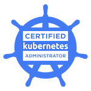

### Hi there 👋

<!--
**slashpai/slashpai** is a ✨ _special_ ✨ repository because its `README.md` (this file) appears on your GitHub profile.

Here are some ideas to get you started:

-->

- 🔭 I’m currently working on cloud platform engineering...
- 🌱 I’m focussing on cloud observability tools and building expertise in kubernetes ...
- 💬 Ask me about programming, infrastructure automation, cloud native applications and devops tools..

  

  ```ruby
  slashpai@pai  ~/github/myrepo/slashpai   master ✚  ruby resume/resume_server.rb
  "Received <Name: name: \"Pai\"> from client rpc call get_job()"
  "Received <Name: name: \"Pai\"> from client rpc call get_interests()"
  "Received <Name: name: \"Pai\"> from client rpc call get_skills()"
  "Received <Name: name: \"Pai\"> from client rpc call get_programming_languages()"
  ```

  ```ruby
  slashpai@pai  ~/github/myrepo/slashpai   master ●  ruby resume/resume_client.rb
  Job Field: Cloud Operations
  Job Role: Senior System Engineer
  Job Experience: 7 years
  Interests: ["Programming", "Distributed Systems", "Designing Micro Services", "Cloud Computing", "Full Stack Web Development", "Machine Learning"]
  Skills: ["Linux", "Hadoop", "Docker", "Kubernetes", "Chef", "Ansible", "Consul", "Terraform", "Openstack", "AWS", "Jenkins", "Zabbix", "Splunk", "Prometheus", "Grafana", "NewRelic", "git", "protobuf", "gRPC", "Selenium"]
  Programming Languages: ["Ruby", "Go", "Python", "Groovy", "Shell", "C", "C++","Java" "JavaScript"]
  ```
